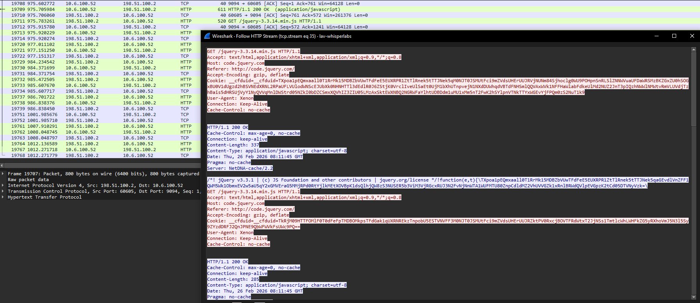

# Tyche

Tyche is a Mythic HTTPX Profile Generator used to create Malleable C2 Profiles from Burpsuite requests, TOML files, and Cobalt Strike Malleable C2 profiles.



## Features

- Convert Burpsuite saved HTTP requests into Mythic C2 HTTPX profiles
- Convert Cobalt Strike Malleable C2 profiles to HTTPX JSON format
- Convert TOML profile files to JSON format
- Lint profiles to ensure that they are valid

## Installation

```bash
pipx install git+https://github.com/Whispergate/Tyche.git
```

## Usage

### Convert Burpsuite Request to HTTPX Profile

Save a request from Burpsuite (right-click --> "Copy to file" or save raw request), then:

```bash
python main.py burp <request_file> --name "MyProfile" [--output profiles/custom.json]
```

Example:
```bash
python main.py burp captured_request.txt --name "Corporate Portal Profile"
```

This will:
1. Parse the HTTP request (method, headers, URI, cookies, body)
2. Generate an HTTPX profile with appropriate client/server sections
3. Save to `profiles/<name>.json` by default

### Convert Malleable C2 Profile to HTTPX JSON

Convert Cobalt Strike Malleable C2 profiles to Mythic HTTPX format:

```bash
python main.py malleable <profile_file> [--name "CustomName"] [--output profiles/custom.json]
```

Example:
```bash
python main.py malleable amazon.profile --name "Amazon Browsing"
```

This will:
1. Parse the Malleable C2 profile (http-get and http-post blocks)
2. Extract URIs, headers, parameters, and transforms
3. Convert to HTTPX JSON format
4. Save to `profiles/<name>.json` by default

Supported Malleable C2 features:
- `http-get` and `http-post` blocks
- Client and server headers
- URI parameters
- Message locations (cookie, parameter, body)
- Transforms (base64, base64url, prepend, append, netbios, netbiosu)
- Metadata and output blocks

### Convert TOML to JSON

```bash
python main.py toml <toml_file> [--output profiles/custom.json]
```

Example:
```bash
python main.py toml templates/example.toml.j2 --output profiles/example.json
```

### Validate HTTPX Profile (Linter)

Validate generated HTTPX profiles for errors and issues, similar to c2lint:

```bash
python main.py lint <profile_file> [--strict] [--quiet]
```

Example:
```bash
python main.py lint profiles/jquery2.4.9.json
```

Options:
- `--strict`: Treat warnings as errors (fail validation if any warnings exist)
- `--quiet`: Suppress info messages, only show errors and warnings

The linter checks for:
- **Structural errors**: Missing required fields, invalid JSON structure
- **Invalid values**: Incorrect HTTP verbs, invalid transform actions, bad message locations
- **Header issues**: Missing recommended headers (User-Agent), suspicious headers
- **URI problems**: Empty URIs, missing leading slash, spaces in URIs
- **Transform validation**: Missing required fields, multiple encoding transforms
- **Message configuration**: Invalid locations, empty names where required

Exit codes:
- `0`: Validation passed (or passed with warnings in non-strict mode)
- `1`: Validation failed (errors found, or warnings in strict mode)

### Convert Profile to Apache, Nginx, and Caddy Rewrite Files

```bash
# Nginx redirector to 10.10.10.5
tyche rewrite profile.json -t nginx -b 10.10.10.5

# Apache2 with custom port
tyche rewrite profile.json -t apache2 -b c2.example.com -p 8443 -o .htaccess

# Caddy without User-Agent matching (HTTP backend)
tyche rewrite profile.json -t caddy -b 192.168.1.100 -s http --no-user-agent
```

## Profile Structure

Generated profiles follow the Mythic HTTPX format:

```json
{
  "name": "Profile Name",
  "get": {
    "verb": "GET",
    "uris": ["/path"],
    "client": {
      "headers": {...},
      "parameters": {...},
      "message": {
        "location": "cookie|body|parameter|uri",
        "name": "param_name"
      },
      "transforms": [...]
    },
    "server": {
      "headers": {...},
      "transforms": [...]
    }
  },
  "post": {...}
}
```

## Examples

### Burpsuite Request Format

```
GET /api/v1/data?token=abc123 HTTP/1.1
Host: example.com
User-Agent: Mozilla/5.0 (Windows NT 10.0; Win64; x64)
Accept: application/json
Cookie: session=xyz789

```

### Output Profile

The tool automatically:
- Extracts HTTP method (GET/POST)
- Parses headers and excludes non-relevant ones
- Identifies message location (cookie, body, parameter)
- Sets up default transforms (base64url encoding)
- Configures default server response headers

## Contributors
- [jquery-c2.3.14.profile](https://github.com/threatexpress/malleable-c2/blob/master/jquery-c2.3.14.profile)
- [Rest of the examples](https://github.com/MythicC2Profiles/httpx/blob/main/documentation-c2/httpx/examples/_index.md)
